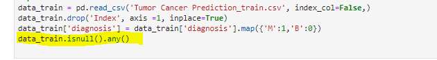
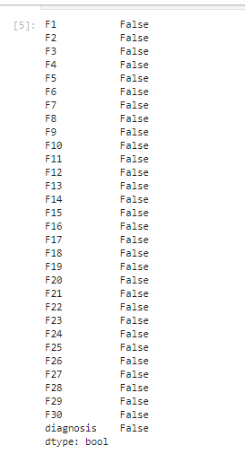
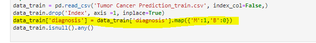

## Project: Tumor Cancer Prediction.

The objective of the projects is to prepare you to apply different machine learning algorithms to real-world tasks. This will help you to increase your knowledge about the workflow of the machine learning tasks. You will learn how to clean your data, applying pre-processing, feature engineering, classification methods.

# **- preprocessing techniques.**

- Check for missing value. 

- map the class label

Transform the class labels from their original string representation (M and B) into integers

- Feature Standardization.

Use sklearn to scale and transform the data

# **-Data analysis.**

- **DataFrame .describe()**

Calculating some statistical data like  **percentile, mean**  and  **std**  of the numerical values of the Series or DataFrame.

-
# Correlation Matrix .

### Observation:

- The f2 and f4 feature have a strong positive correlation with f6,f8 and f9 feature;
- The f21 and f22 feature have a weak correlation with f24,f8 and f19 feature;

- countplot

### Observation:

Number of benign tumor data more than number of malignant tumor data

- boxplot

### Observation:

mostof the values are usually higher in malignant than that of benign    

# **-**

#

# **Sizes of training and validation sets.**

80% of the data for training and the remaining 20% for validation.

# **- Hyperparameter tuning.**

- **SVM**

Hyperparameter:

- Kernel:

- sigmoid

accuracy score =0.945054945054945.

- linear

accuracy score =0.978021978021978.

- rbf

accuracy score =0.978021978021978.

- gamma:

- 0.001

accuracy score =0.9560439560439561.

- 0.0001

accuracy score =0.7362637362637363.

- 0.01

Accuracy score =0.978021978021978.

- **Decision Tree.**

Hyperparameter:

- max\_depth:

- (None)

Accuracy score =0.9340659340659341.

- (2**)**

Accuracy score =0.9560439560439561.

- (4**)**

Accuracy score =0.945054945054945

- min\_samples\_leaf:

- (10)

accuracy score =0.9560439560439561.

- (6**)**

Accuracy score =0.967032967032967

- (4**)**

Accuracy score =0.9340659340659341

- **xgboost.**

Hyperparameter:

- max\_depth:

- (3)

accuracy score =0.978021978021978

- (2**)**

Accuracy score =0.967032967032967

- (4**)**

Accuracy score =0.967032967032967

- learning\_rate:

- (0.05)

Accuracy score =0.978021978021978.

- (0.5**)**

Accuracy score =0.967032967032967

- (0.10**)**

Accuracy score =0.978021978021978

# **- Dimensionality Reduction.**

- **PCA**

- SVM:

- (0.90)

Accuracy score =0.978021978021978.

- (0.50**)**

Accuracy score =0.9340659340659341

- (25**)**

Accuracy score =0.978021978021978

.

- Decision Tree:

- (0.90)

Accuracy score =0.9340659340659341

- (25**)**

Accuracy score =0.9340659340659341

- (0.70**)**

Accuracy score =0.9230769230769231

.

- xgboost:

- (0.90)

Accuracy score =0.945054945054945

- (0.50**)**

Accuracy score =0.9340659340659341

- (24**)**

Accuracy score =0.9560439560439561

.

.

# **- Training Time graph.**

# **- Testing Time graph.**

# **- Testing Time graph with using PCA.**

# **- Training Time graph with using PCA.**

# **- Accuracy graph**

# **- Accuracy graph with using PCA**

##
# **Summary**

_We applied_ _Decision Tree,__XGBoosts_ _and Support Vector Machine (SVM)_

_algorithms __to__ the Tumor Cancer dataset._

• _To predict whether the Tumor cancer is malignant or benign._
_• Compared the performance results of all the algorithms based on_

_the accuracy values. __and showed that_ _XGBoosts__ classifier is the best_

_among all in determining benign and malignant tumors._